# Model Evaluation & Performance Report

This report presents the performance metrics, inference latency, throughput, and confidence score distributions for the models in FraudShield AI:
1. **Fraud Detection Model (`fraud_model.pkl`)** evaluated on the standard `fraudTest.csv` dataset.
2. **Credit Card Anomaly Model (`creditcard_model.pkl`)** evaluated on a stratify-split 20% test partition of the `creditcard.csv` dataset.

---

## 📊 Summary Performance Metrics

| Metric | Fraud Detection Model (`fraud_model`) | Credit Card Anomaly Model (`creditcard_model`) |
| :--- | :---: | :---: |
| **Test Dataset Source** | `fraudTest.csv` | `creditcard.csv` (20% Split) |
| **Test Dataset Size** | 555,719 samples | 56,962 samples |
| **Accuracy** | **98.77%** (0.9877) | **99.99%** (0.9999) |
| **Precision** | **21.16%** (0.2116) | **100.00%** (1.000) |
| **Recall** | **80.23%** (0.8023) | **93.88%** (0.9388) |
| **F1-Score** | **33.49%** (0.3349) | **96.84%** (0.9684) |
| **Avg. Response Time (Latency)** | **4.64 ms** | **1.08 ms** |
| **Throughput (Inferences / Sec)**| **215.46 predictions/sec** | **925.42 predictions/sec** |

> [!NOTE]
> The **Fraud Detection Model** exhibits lower precision (21.16%) because it was evaluated on an imbalanced dataset where the actual positive rate (fraud rate) is extremely low. However, its recall of **80.23%** indicates that it successfully flags the majority of fraud cases. 
> The **Credit Card Anomaly Model** achieves exceptionally high metrics due to a cleaner feature space and being trained on highly discriminative PCA features.

---

## ⚡ Inference Latency Benchmarks
*Timed over 5,000 individual single-sample inferences to simulate production request-response behavior.*

```mermaid
gantt
    title Single-Sample Latency Profiling (ms)
    dateFormat  X
    axisFormat %s
    
    section Fraud Model
    Average Latency : active, 0, 4.64
    95th Percentile (p95) : 0, 9.81
    99th Percentile (p99) : 0, 13.37
    
    section Credit Card Model
    Average Latency : active, 0, 1.08
    95th Percentile (p95) : 0, 2.34
    99th Percentile (p99) : 0, 3.69
```

- **Fraud Model Throughput**: `215.46 predictions per second`
- **Credit Card Model Throughput**: `925.42 predictions per second`

---

## 📈 Model Confidence Distributions

The tables below group predictions by the model's output probability (0.0 to 1.0) and show how the counts break down across actual classes (Legitimate vs. Fraud) and correctness of predictions.

### 1. Fraud Detection Model (`fraud_model`)
*Confidence threshold of 0.5 is used for prediction class mapping.*

| Probability Range | Overall Count | Overall % | Actual Legit (y=0) | Actual Fraud (y=1) | Correct Preds | Incorrect Preds |
| :---: | :---: | :---: | :---: | :---: | :---: | :---: |
| **0.0 - 0.1** | 525,663 | 94.59% | 525,509 | 154 | 525,509 | 154 |
| **0.1 - 0.2** | 10,909 | 1.96% | 10,847 | 62 | 10,847 | 62 |
| **0.2 - 0.3** | 5,319 | 0.96% | 5,262 | 57 | 5,262 | 57 |
| **0.3 - 0.4** | 3,396 | 0.61% | 3,321 | 75 | 3,321 | 75 |
| **0.4 - 0.5** | 2,298 | 0.41% | 2,222 | 76 | 2,222 | 76 |
| **0.5 - 0.6** | 1,975 | 0.36% | 1,886 | 89 | 89 | 1,886 |
| **0.6 - 0.7** | 1,575 | 0.28% | 1,489 | 86 | 86 | 1,489 |
| **0.7 - 0.8** | 1,319 | 0.24% | 1,216 | 103 | 103 | 1,216 |
| **0.8 - 0.9** | 981 | 0.18% | 832 | 149 | 149 | 832 |
| **0.9 - 1.0** | 2,284 | 0.41% | 990 | 1,294 | 1,294 | 990 |
| **Total** | **555,719** | **100%** | **553,574** | **2,145** | **548,882** | **6,837** |

---

### 2. Credit Card Anomaly Model (`creditcard_model`)
*Confidence threshold of 0.5 is used for prediction class mapping.*

| Probability Range | Overall Count | Overall % | Actual Legit (y=0) | Actual Fraud (y=1) | Correct Preds | Incorrect Preds |
| :---: | :---: | :---: | :---: | :---: | :---: | :---: |
| **0.0 - 0.1** | 56,768 | 99.66% | 56,768 | 0 | 56,768 | 0 |
| **0.1 - 0.2** | 88 | 0.15% | 88 | 0 | 88 | 0 |
| **0.2 - 0.3** | 8 | 0.01% | 7 | 1 | 7 | 1 |
| **0.3 - 0.4** | 0 | 0.00% | 0 | 0 | 0 | 0 |
| **0.4 - 0.5** | 2 | <0.01% | 0 | 2 | 0 | 2 |
| **0.5 - 0.6** | 10 | 0.02% | 1 | 9 | 7 | 3 |
| **0.6 - 0.7** | 6 | 0.01% | 0 | 6 | 6 | 0 |
| **0.7 - 0.8** | 0 | 0.00% | 0 | 0 | 0 | 0 |
| **0.8 - 0.9** | 7 | 0.01% | 0 | 7 | 7 | 0 |
| **0.9 - 1.0** | 73 | 0.13% | 0 | 73 | 73 | 0 |
| **Total** | **56,962** | **100%** | **56,864** | **98** | **56,956** | **6** |
